# POS Apotek - UML Diagrams

> Render online: [mermaid.live](https://mermaid.live) atau paste di GitHub/Notion.

---

## 1. Class Diagram

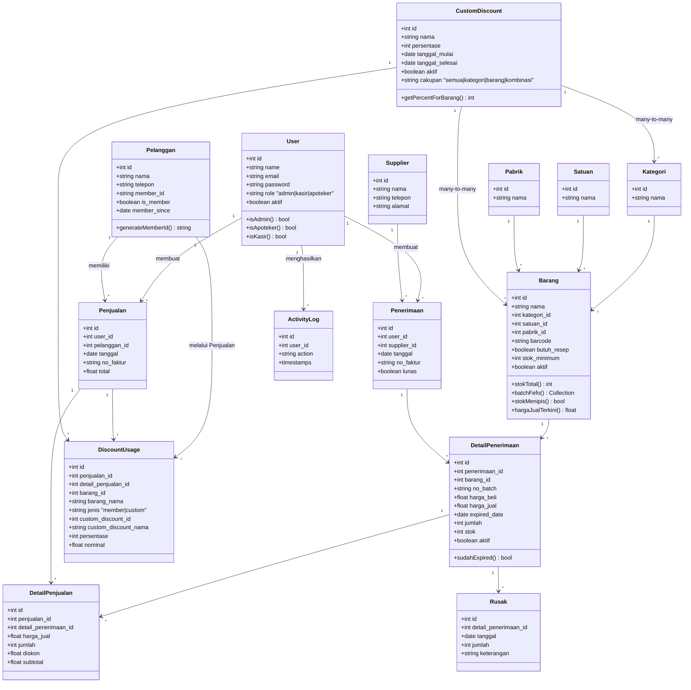

---

## 2. Entity Relationship Diagram (ERD)

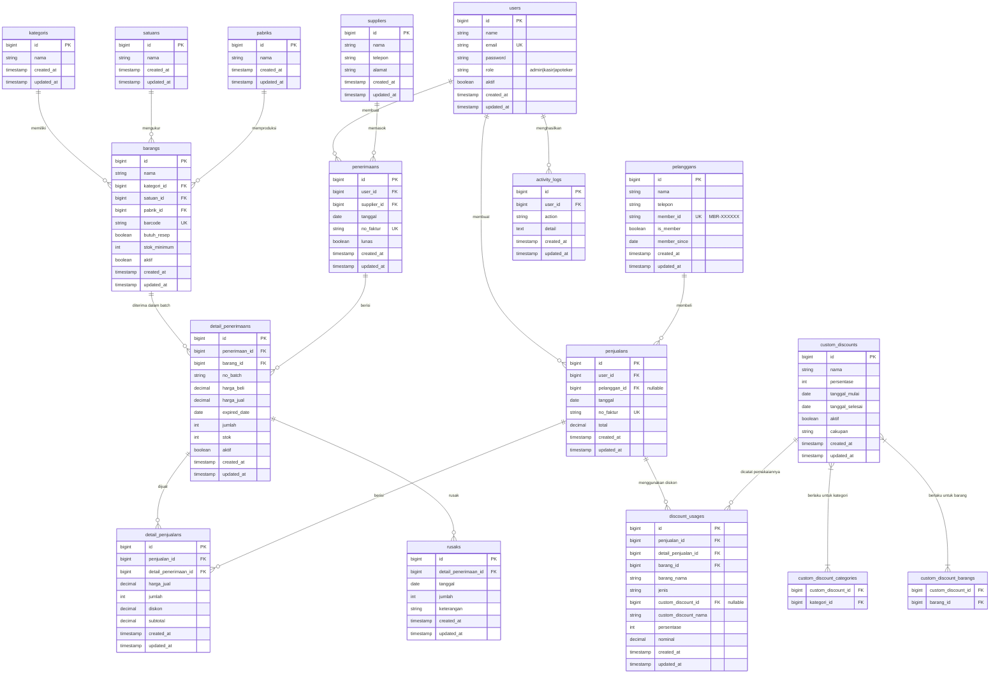

---

## 3. Use Case Diagram

```mermaid
graph TB
    subgraph Actors[" "]
        admin["👤 Admin"]
        kasir["👤 Kasir"]
        apoteker["👤 Apoteker"]
    end

    subgraph UC["POS Apotek System"]
        direction TB
        UC1(["🔐 Login"])
        UC2(["📊 Dashboard"])
        UC3(["🏷️ Kelola Kategori"])
        UC4(["📐 Kelola Satuan"])
        UC5(["🏭 Kelola Pabrik"])
        UC6(["🚚 Kelola Supplier"])
        UC7(["📦 Kelola Barang"])
        UC8(["👥 Kelola Pelanggan"])
        UC8a(["📋 Daftar Member"])
        UC9(["📥 Penerimaan Barang"])
        UC10(["⚠️ Catat Barang Rusak"])
        UC11(["💰 Proses Penjualan"])
        UC12(["🏷️ Kelola Promo"])
        UC12a(["🔄 Toggle Promo"])
        UC13(["📈 Laporan Stok"])
        UC14(["📈 Laporan Penerimaan"])
        UC15(["📈 Laporan Penjualan"])
        UC16(["📈 Laporan Rusak"])
        UC17(["📈 Laporan Laba Rugi"])
        UC18(["📈 Laporan Diskon"])
        UC19(["📤 Export CSV"])
        UC20(["📝 Activity Log"])
    end

    admin --> UC1
    admin --> UC2
    admin --> UC3
    admin --> UC4
    admin --> UC5
    admin --> UC6
    admin --> UC7
    admin --> UC8
    admin --> UC9
    admin --> UC10
    admin --> UC11
    admin --> UC12
    admin --> UC13
    admin --> UC14
    admin --> UC15
    admin --> UC16
    admin --> UC17
    admin --> UC18
    admin --> UC20

    kasir --> UC1
    kasir --> UC2
    kasir --> UC7
    kasir --> UC8a
    kasir --> UC11

    apoteker --> UC1
    apoteker --> UC2

    UC12 -.-> UC12a
    UC13 -.-> UC19
    UC14 -.-> UC19
    UC15 -.-> UC19
    UC16 -.-> UC19
    UC18 -.-> UC19

    classDef actor fill:#e3f2fd,stroke:#1976d2,stroke-width:2px,font-weight:bold
    classDef usecase fill:#f3e5f5,stroke:#7b1fa2,stroke-width:1px,rx:50

    class admin,kasir,apoteker actor
    class UC1,UC2,UC3,UC4,UC5,UC6,UC7,UC8,UC8a,UC9,UC10,UC11,UC12,UC12a,UC13,UC14,UC15,UC16,UC17,UC18,UC19,UC20 usecase
```

---

## 4. Sequence Diagram - Transaksi Penjualan

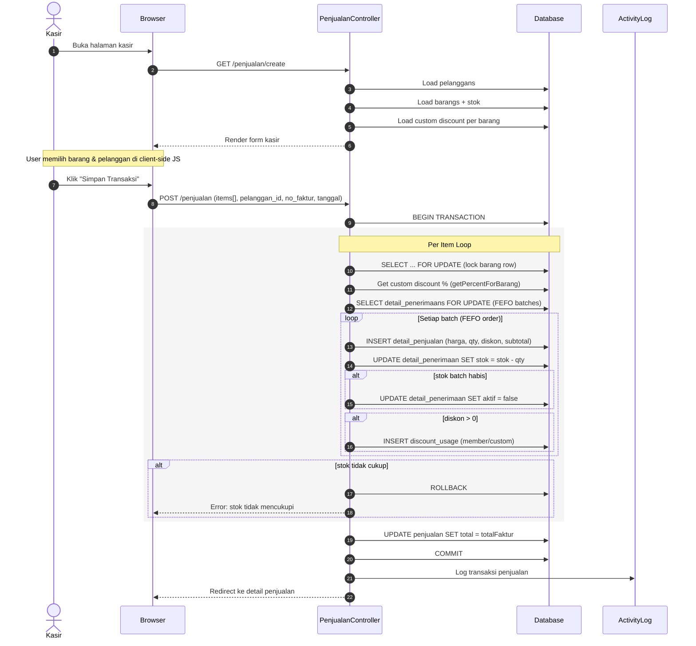

---

## 5. Sequence Diagram - Penerimaan Barang

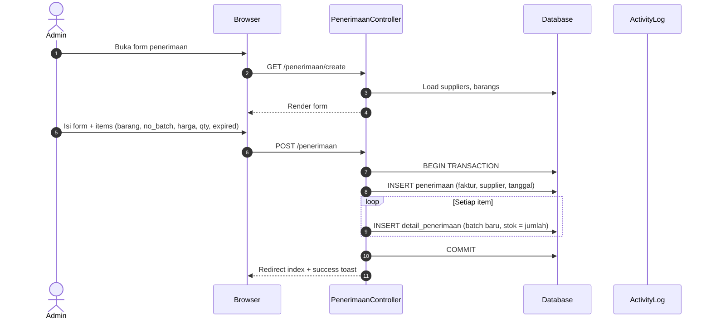

---

## 6. Sequence Diagram - Login & Auth

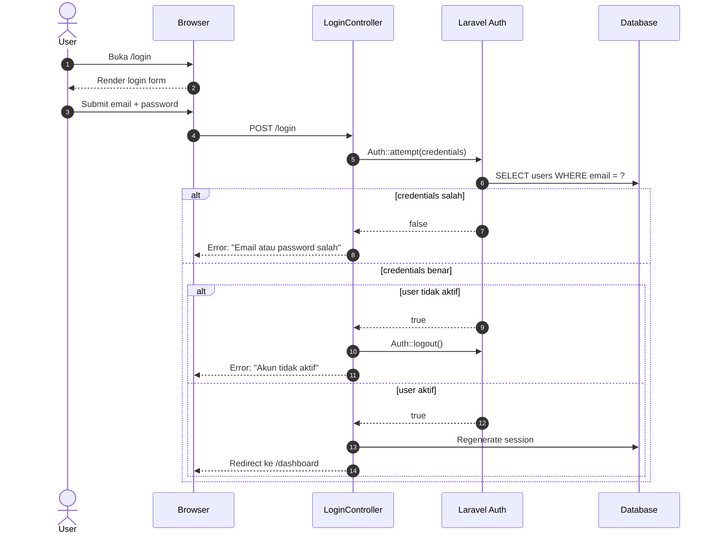

---

## 7. Sequence Diagram - Register Member

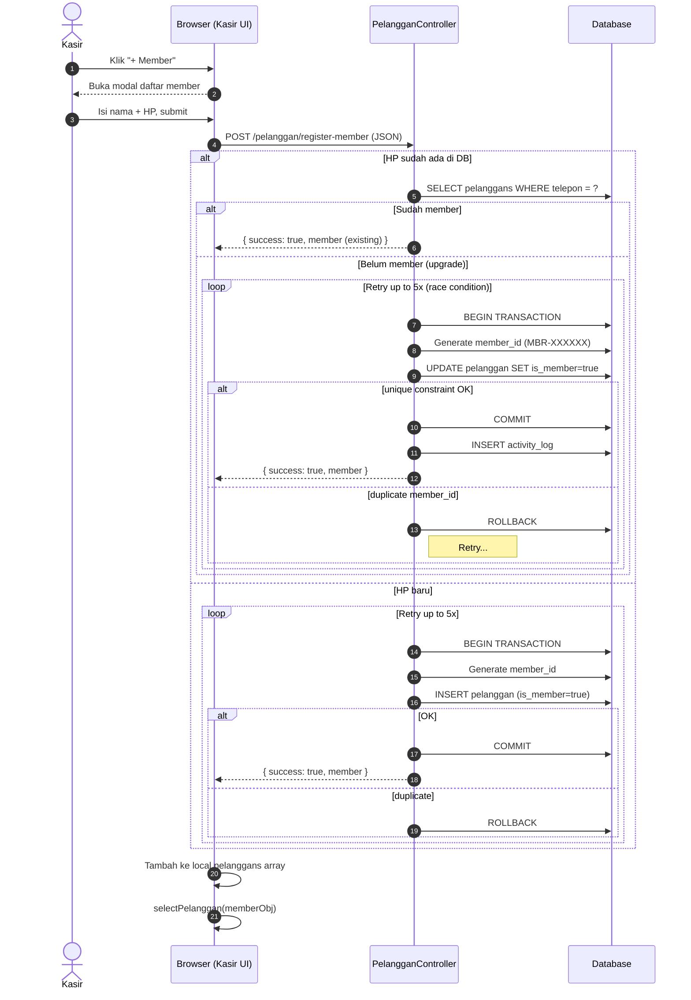

---

## 8. Activity Diagram - Alur Transaksi Penjualan

```mermaid
flowchart TD
    Start([Mulai]) --> OpenKasir[Buka Halaman Kasir]
    OpenKasir --> LoadData[Load Data: Barang + Pelanggan + Discount]
    LoadData --> SearchBarang[Cari / Pilih Barang]

    SearchBarang --> AddToCart[Tambah ke Keranjang]
    AddToCart --> CheckStokClient{Stok Cukup?}
    CheckStokClient -->|Ya| ShowSubtotal[Tampilkan Subtotal + Diskon]
    CheckStokClient -->|Tidak| WarnStok[Warning: Stok Kurang]
    WarnStok --> SearchBarang

    ShowSubtotal --> MoreItem{Tambah Lagi?}
    MoreItem -->|Ya| SearchBarang
    MoreItem -->|Tidak| SelectPelanggan[Pilih Pelanggan / Member]

    SelectPelanggan --> SetFaktur[Isi No. Faktur + Tanggal]
    SetFaktur --> Submit[Simpan Transaksi]

    Submit --> ValidateServer{Validasi Server}
    ValidateServer -->|Gagal| ShowError[Tampilkan Error]
    ShowError --> SearchBarang

    ValidateServer -->|OK| BeginTx[BEGIN TRANSACTION]
    BeginTx --> LoopItem{Untuk Setiap Item}

    LoopItem --> LockBarang[Lock Row Barang FOR UPDATE]
    LockBarang --> GetDiscount[Ambil Diskon Custom %]
    GetDiscount --> CalcTotalDiskon[Diskon Total = min(50%, Member% + Custom%)]
    CalcTotalDiskon --> GetBatches[Ambil Batch FEFO]
    GetBatches --> LoopBatch{Untuk Setiap Batch}

    LoopBatch --> CalcSubtotal[Subtotal = (Harga x Qty) - Diskon]
    CalcSubtotal --> InsertDetail[INSERT detail_penjualan]
    InsertDetail --> DecStok[UPDATE stok batch]
    DecStok --> CheckStokHabis{Stok Batch Habis?}
    CheckStokHabis -->|Ya| DeactivateBatch[SET aktif = false]
    CheckStokHabis -->|Tidak| LogDiscount{Ada Diskon?}

    DeactivateBatch --> LogDiscount
    LogDiscount -->|Ya| InsertDiscountUsage[INSERT discount_usage]
    LogDiscount -->|Tidak| CheckSisa{Sisa Qty > 0?}

    InsertDiscountUsage --> CheckSisa
    CheckSisa -->|Ya| LoopBatch
    CheckSisa -->|Tidak| CheckAllItem{Item Lain?}

    CheckAllItem -->|Ya| LoopItem
    CheckAllItem -->|Tidak| UpdateTotal[UPDATE penjualan.total]
    UpdateTotal --> LogActivity[Log Activity]
    LogActivity --> CommitTx[COMMIT]
    CommitTx --> Success[Redirect: Detail Penjualan + Success Toast]
    Success --> End([Selesai])
```

---

## 9. Activity Diagram - Kelola Custom Discount

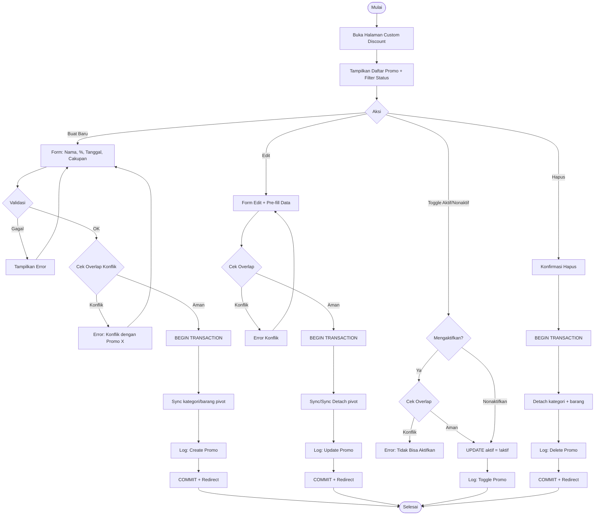

---

## 10. Component Diagram

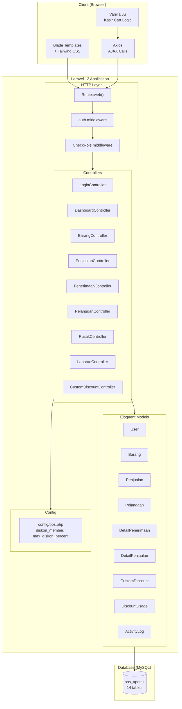

---

## 11. State Diagram - Status Barang

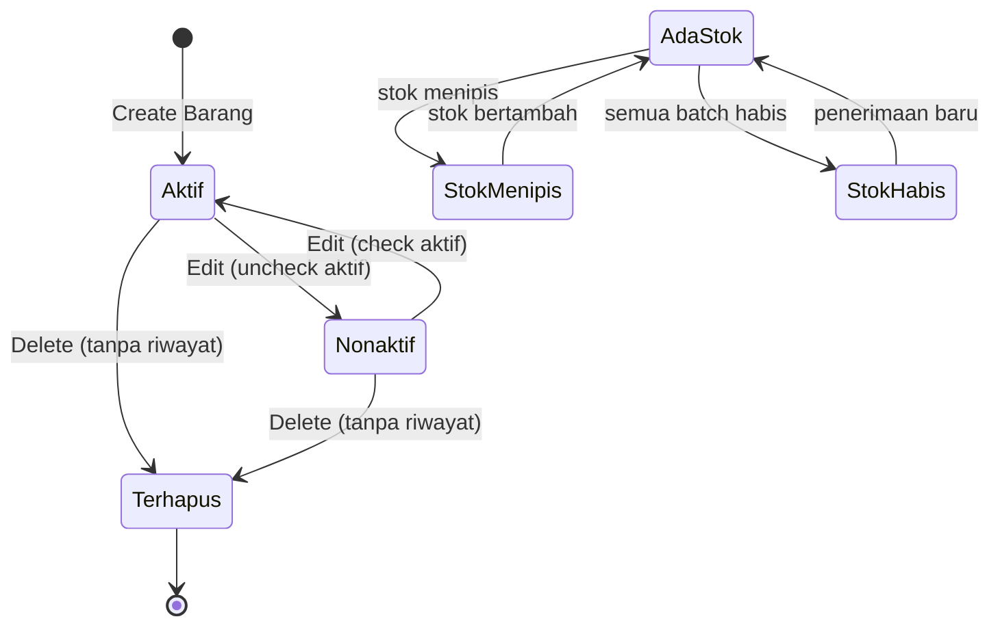

---

## 12. State Diagram - Status Custom Discount

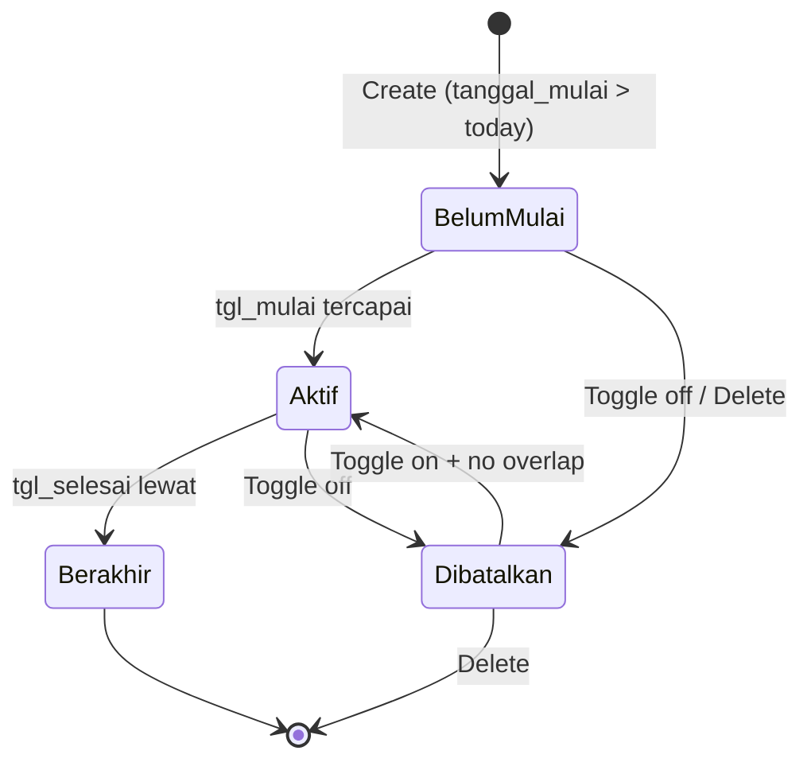

---

## Ringkasan

| Diagram | File | Kegunaan |
|---------|------|----------|
| Class Diagram | Section 1 | Struktur model & relasi |
| ERD | Section 2 | Schema database lengkap |
| Use Case | Section 3 | Hak akses per role |
| Sequence - Penjualan | Section 4 | Alur transaksi kasir |
| Sequence - Penerimaan | Section 5 | Alur masuk barang |
| Sequence - Login | Section 6 | Autentikasi |
| Sequence - Register Member | Section 7 | Pendaftaran member |
| Activity - Penjualan | Section 8 | Detail alur kasir |
| Activity - Custom Discount | Section 9 | Manajemen promo |
| Component | Section 10 | Arsitektur tingkat tinggi |
| State - Barang | Section 11 | Lifecycle barang |
| State - Discount | Section 12 | Lifecycle promo |

> **Cara render**: Buka [mermaid.live](https://mermaid.live), copy-paste code block yang diinginkan.
